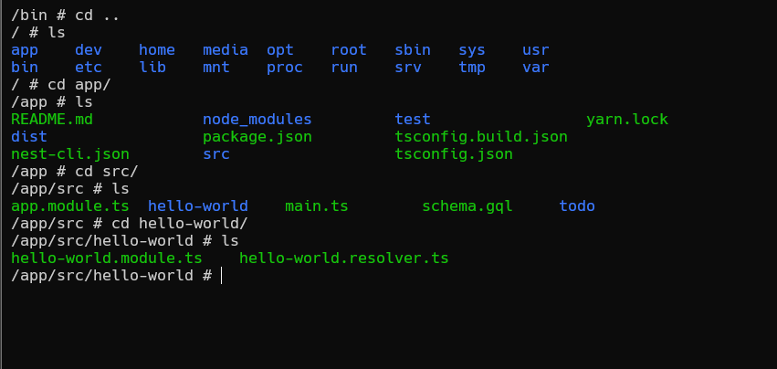

## it: Interactive Terminal

Concepto: un terminal interactivo permite ejecutar comandos y ver la salida en tiempo real, facilitando la interacción directa con contenedores y procesos en ejecución.

docker exec -it ID /bin/sh
busca dentro del file system del contenedor y busque en bin y ejecute sh.

## editar un archivo 

cat: imprimir info de consola del archivo
ejemp(cat hello-world.resolver.ts)

vi: edita un archivo
vi hello-world.resolver.ts

precionas (i) para editar y luego para salir Esc luego (:wq!) y enter para salir

exit para salir de termal interactiva