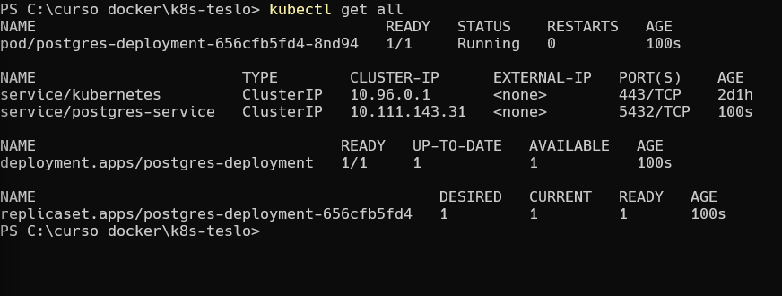

# iniciar minikube primero por si no lo esta 
minikube start

# ver ip de nuestro cluster

kubectl get all

# con este comando

kubectl apply -f postgres-config.yml

si precionas tab
kubectl apply -f .\postgres-config.yml

# lo mismo pero con secrets

kubectl apply -f .\postgres-secrets.yml

# ahora con nuestro deployment 

kubectl apply -f .\postgres.yml

# revisar estado 

kubectl get all

es posible que la primera ves no este listo 
