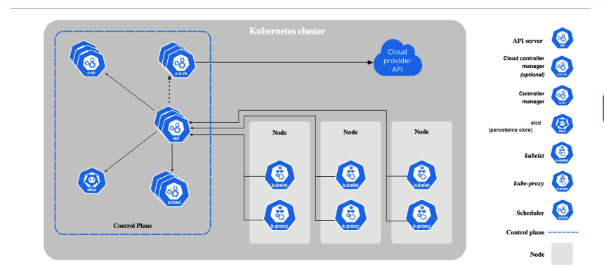
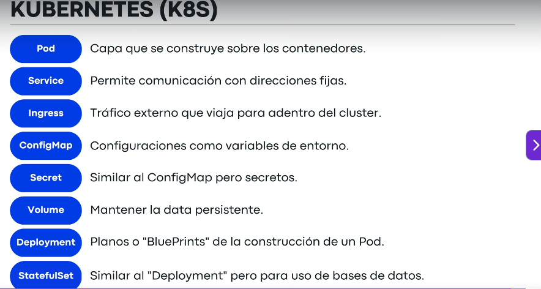

# Introducción a Kubernetes

Kubernetes (K8S) es un sistema de orquestación para administrar grandes conjuntos de contenedores. Permite automatizar el despliegue, escalado y gestión de aplicaciones en contenedores.

## Conceptos básicos

- **Pod**: Es la unidad más básica en Kubernetes. Un pod puede contener uno o varios contenedores y define aspectos como el número de réplicas, la dirección IP y otros recursos asociados.
- **Nodo**: Es una máquina física o virtual donde se ejecutan los pods.
- **Cluster**: Conjunto de nodos gestionados por Kubernetes.
- **ReplicaSet**: Controla el número de réplicas de un pod que deben estar corriendo en todo momento.
- **Deployment**: Permite gestionar actualizaciones y el ciclo de vida de los pods de manera declarativa.
- **Service**: Expone los pods para permitir la comunicación interna o externa.

## Ventajas de Kubernetes

- Escalabilidad automática de aplicaciones.
- Alta disponibilidad y recuperación ante fallos.
- Gestión eficiente de recursos.
- Integración con diferentes proveedores de nube.

## Ejemplo de uso

```yaml
apiVersion: v1
kind: Pod
metadata:
    name: ejemplo-pod
spec:
    containers:
        - name: nginx
            image: nginx:latest
```

Este ejemplo crea un pod con un contenedor que ejecuta Nginx.

# Presentacion

 Kubernetes es una plataforma para aotomatizar el despliegue escala y manejo de contenedores. originalmente creado por google.

Que problemas resuelve??

Usuarios esperan un servicio 24/7.

los de it esperan hacer muchos despliegues en un dia sin detener el servicio que esta corriendo: permitiria tener cambios en caliente sin detener el servicio.

las companias esperan mayor eficiciencia de los recursos de la nube: todo el tiempo que este un servicio en la nube se esta facturando

un sistema tolerante a fallas en el mommento que algo salga mal: si la app crashe no se detenga.

Escala hacia arriba y hacia abajo segun demanda.


Orquestacion es basicamente lo que hace kubernetes

- manejo automatico de aplicaciones en contenedores
- alta disponibilidad
- practicamnete no hay "downtimes (poder cambiar algo en la aplicacion sin tener que detener todos los procesos y tambien mas facil remplazar por otras versiones)" en reemplazos de versiones.

- facil manejo de replicas: puede ser que tengamos nuestra app que pueda tener varias copias , si la replica 1 se cae tenemos la dos o la tres lo cual es muy util.

Componentes principales.

pod: son los objetos implementables mas pequenos y basicos en k8s

- Es una capa abstracta sobre uno o mas contenedores
- Esto permite remplezarlos facilmente
- tienen ip unica asignada , que al reconstruirse cambia
----------------------------------------------------------------------

Services: tienen una ip unica asignada y el servicio sabe que contenedor o cual es la direccion de esos contenedores y asi permite una comunicacion facilmente entre ellos , sin importar que la direccion ip del contenedor cambie.

Dos tipos de servicios internos y externos

- ip permanente
- ciclo de vida del POD y servicios son independientes.

-----------------------------------------------------------------------

Ingress: una nueva solicitud a nuestro sitio web (por ejemplo) entra primero por ingress y este a los respectivos servicios.

-------------------------------------------------------------------------
ConfigMap : podemos verlo como las variables de entornos , cual es la url de base de datos , donde esta la informacion y son esas variables de entornos que no son privadas no importan si las gente las ve pxq es un objeto plano.

-------------------------------------------------------------------------
secrets: son como configmap pero relativamente seguros , esta incriptada por defecto en string base64, pero los secrets surven para mantener ciertas variables tambien de entorno que necesitan ser ocultadas ejemplo el jwt , la firma, alguna llave del backend o  bueno un valor que no necesitas que la gente conozca su valor.

-------------------------------------------------------------------------
volume: discos duros externos que se van acoplando a nuestro cluster, kubernetes no maneja la persistencia de nuestra data es algo que debemos manejar por nuetro lado .

-------------------------------------------------------------------------
deployment: es un plano o blueprint para crear POD y la cantidad de replicas. aqui es donde escalar arriba o abajo las replicas.

------------------------------------------------------------------------
statefulset: muy parecido al deployment pero especializado en base de datos , es el plano similar a los deployment , pero para bases de datos principalmnete.

------------------------------------------------------------------------

cluster : un grupo de nodos que corren aplicaciones en contenedores de una forma eficiente , automatizada , distribuida y escalable



-----------------------------------------------------------------------




Documentacion

https://kubernetes.io/es/docs/concepts/